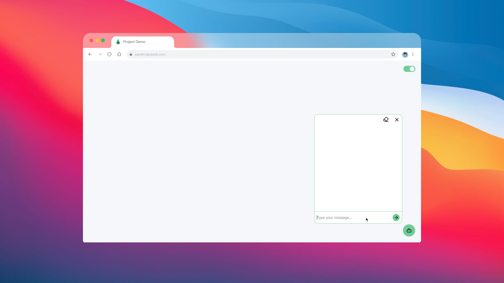

[](https://psairam9301.wixsite.com/website) 
[](https://www.youtube.com/@sairampenjarla) 
[](https://github.com/sairam-penjarla) 
[](https://www.linkedin.com/in/sairam-penjarla-b5041b121/) 
[](https://www.instagram.com/sairam.ipynb/)

# 📌 PDF-RAG AI Chatbot

An AI chatbot built using **Retrieval-Augmented Generation (RAG)**, OpenAI, Flask, Python, and ChromaDB. The chatbot is designed to answer questions based on a structured knowledge base created from publicly available PDFs and web pages related to **L&T Construction Company**.

---

## 🚀 Getting Started

### 1️⃣ Clone the Repository

```sh
git clone https://github.com/sairam-penjarla/pdf-rag-ai-chatbot.git
cd pdf-rag-ai-chatbot
```

### 2️⃣ Create a Virtual Environment

Follow this blog post for setting up a **virtual environment** or **Anaconda environment**:  
🔗 [Environment Setup Guide](https://sairampenjarla.notion.site/Environment-171d56a2fc2780dd9efcd4cef331fa2c)

For a virtual environment:
```sh
python -m venv venv
source venv/bin/activate  # On macOS/Linux
venv\Scripts\activate      # On Windows
```

For an Anaconda environment:
```sh
conda create --name rag-chatbot python=3.9
conda activate rag-chatbot
```

### 3️⃣ Install Dependencies

```sh
pip install -r requirements.txt
```

### 4️⃣ Set Up API Key

Create a `.env` file in the project root and add your **OpenAI API Key**:

```
OPENAI_API_KEY=your_openai_api_key_here
```

### 5️⃣ Run the Project

```sh
python app.py
```

The application will be available at `http://localhost:5000`.

---

## 📌 Project Overview

### 🔹 Features
- Uses **RAG** to fetch relevant data from a **ChromaDB knowledge base**.
- Chatbot is trained using publicly available **PDFs and web pages** about **L&T Construction**.
- Users can ask questions, and the bot retrieves and generates accurate responses.
- Provides **reference links** for every answer.
- **Session management**: Previous chat sessions are stored and can be revisited via the sidebar.
- **Smart Prompt Engineering**: Detects irrelevant or inappropriate queries and responds accordingly.
- Built with **Flask, OpenAI API, SQLite, JavaScript, HTML, and CSS**.
- Uses **streaming responses** for a natural typing effect.
- Displays a **loading animation** while processing responses.
- **Sidebar with session history** and delete options for individual sessions or all at once.
- Uses **Lucide.dev icons** for an aesthetic UI.

### 🔹 How It Works
1. The user submits a question.
2. The backend queries **ChromaDB** to retrieve relevant content.
3. The retrieved content + question is sent to OpenAI’s API.
4. The response is streamed back **word by word** for a natural effect.
5. The session and responses are stored in an **SQLite database**.
6. Users can click on previous sessions in the sidebar to revisit past chats.

### 🔹 Architecture Diagram
📌 **How the chatbot processes user requests**  
  

**Description**:  
- The user submits a request → `get_relevant_content` fetches data from the knowledge base.  
- The retrieved content is sent to `invoke_agent`, which calls OpenAI’s API.  
- The response is streamed back to the frontend.  
- After completion, the session is updated in the database via `update_session`.  

---

## 📌 Screenshots

| Screenshot | Description |
|------------|------------|
|  | **Welcome screen** |
|  | **How chatbot responses look in light mode** |
|  | **Sidebar showing previous sessions** |
|  | **Loading animation while processing input** |
|  | **Chatbot UI in dark mode** |
|  | **Expanded reference section** |

---

## 📌 Blog Article
For a detailed breakdown of the project, visit the blog post:  
🔗 **[RAG AI Chatbot – Full Guide](https://sairampenjarla.notion.site/RAG-AI-Chatbot-18dd56a2fc27803e91c7d76dbcb8d2b9)**

---

## 📌 Connect with Me

[](https://psairam9301.wixsite.com/website)  
[](https://www.youtube.com/@sairampenjarla)  
[](https://github.com/sairam-penjarla)  
[](https://www.linkedin.com/in/sairam-penjarla-b5041b121/)  
[](https://www.instagram.com/sairam.ipynb/)  

🚀 **Star the repo if you found this useful!**  