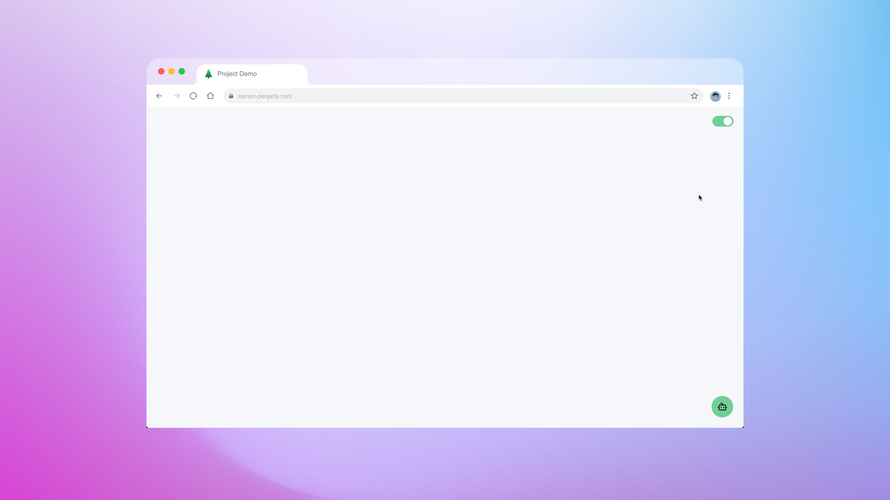

# [](https://psairam9301.wixsite.com/website) [](https://www.youtube.com/@sairampenjarla) [](https://github.com/sairam-penjarla) [](https://www.linkedin.com/in/sairam-penjarla-b5041b121/) [](https://www.instagram.com/sairam.ipynb/)

# 🔹 Virtual Assistant Chatbot with RAG Backend

A powerful virtual assistant chatbot built using OpenAI, ChromaDB, and Flask, designed to intelligently answer questions based on a structured knowledge base.

🔗 [Demo Video](https://youtu.be/G8PiPLIsBJA?si=56FAdRbMewBG9eR5)

---

## 🚀 Installation & Setup

Follow these steps to set up and run the project locally.

### 1️⃣ Clone the Repository

```bash
git clone https://github.com/sairam-penjarla/virtual-assistant-bot.git
cd virtual-assistant-bot
```

### 2️⃣ Set Up a Virtual Environment

Follow this guide on creating a virtual environment:  
🔗 [How to Create a Virtual Environment](https://sairampenjarla.notion.site/Environment-171d56a2fc2780dd9efcd4cef331fa2c)

#### Using `venv` (Python's Built-in Virtual Environment)
```bash
python -m venv venv
source venv/bin/activate   # For macOS/Linux
venv\Scripts\activate      # For Windows
```

#### Using Anaconda
```bash
conda create --name chatbot_env python=3.9
conda activate chatbot_env
```

### 3️⃣ Install Dependencies
```bash
pip install -r requirements.txt
```

### 4️⃣ Set Up OpenAI API Key  
Create a `.env` file in the root directory and add your OpenAI API key:

```
OPENAI_API_KEY=your_openai_api_key_here
```

### 5️⃣ Run the Project
```bash
python app.py
```

The chatbot will now be available on `http://localhost:5000/`.

---

## 📌 Project Overview

This project is a virtual assistant chatbot that interacts with users through a web interface. The chatbot utilizes a **Retrieval-Augmented Generation (RAG) backend**, combining **OpenAI, ChromaDB, and sentence transformers** to generate intelligent responses.

### 🔥 Features

- 💬 **Toggle Chatbot Window** – The chatbot remains hidden until the user clicks on the chat icon.
- 🗑️ **Erase Conversations** – Users can clear previous interactions with one click.
- 🔍 **Knowledge-Based Responses** – Answers are sourced from structured L&T Construction data.
- 🔗 **Reference Links** – The chatbot cites sources for transparency.
- ⏳ **Loading Animation** – Smooth user experience with real-time response streaming.
- 🚫 **Inappropriate Question Handling** – Well-engineered prompts ensure the chatbot responds politely to irrelevant queries.
- 🎨 **Dark Mode & Light Mode Support**
- 🛠️ **Built with**:
  - `OpenAI API`
  - `ChromaDB`
  - `Flask`
  - `Python`
  - `SQLite`
  - `HTML, CSS, JavaScript`

---

## 🖼️ Screenshots

| **Description** | **Screenshot** |
|:--------------|:--------------:|
| **1. Blank Webpage** - The chatbot icon and toggle button are displayed, but the chat window is hidden. |  |
| **2. Chatbot Window Opened** - The conversation window pops up when the user clicks on the chatbot icon. |  |
| **3. Loading Animation** - A loading animation appears before the chatbot starts generating a response. |  |
| **4. Light Mode Conversation with Loading Animation** - The chatbot is generating a response while in light mode. |  |
| **5. Light Mode Conversation** - A complete chatbot response in light mode, including reference links. |  |
| **6. Dark Mode Conversation** - A conversation displayed in dark mode. |  |
| **7. Dark Mode with Loading Animation** - Another chatbot response in dark mode while loading. |  |

---

## 📖 Architecture Diagram


---

## 📚 Learn More

🔗 **GitHub Repository:** [Virtual Assistant Bot](https://github.com/sairam-penjarla/virtual-assistant-bot/)  
🔗 **Project Blog Post:** [Read More](https://sairampenjarla.notion.site/Virtual-Assistant-19ad56a2fc27802984c5e0287e4aec30?pvs=4)  

---

## ✨ Connect with Me!

[](https://psairam9301.wixsite.com/website)   [](https://www.youtube.com/@sairampenjarla)   [](https://github.com/sairam-penjarla)   [](https://www.linkedin.com/in/sairam-penjarla-b5041b121/)   [](https://www.instagram.com/sairam.ipynb/)  